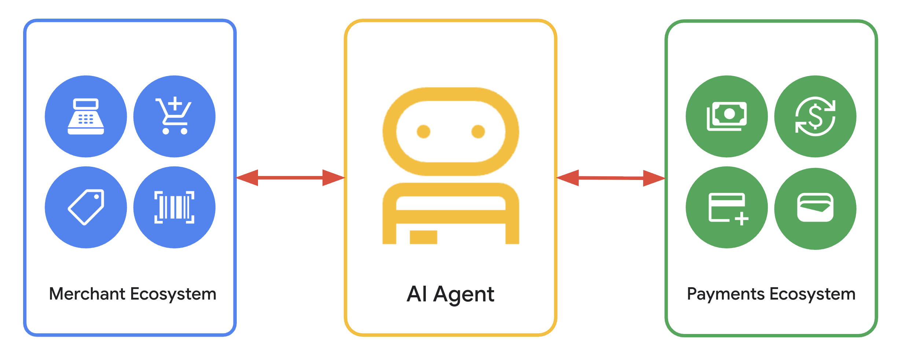

# Agent Payments Protocol (AP2)

[](LICENSE)
[](https://deepwiki.com/google-agentic-commerce/AP2)

<!-- markdownlint-disable MD041 -->
<p align="center">
  
</p>

This repository contains code samples and demos of the Agent Payments Protocol.

## Intro to AP2 Video

[](https://youtu.be/jSHj0z9Gi24?si=JyzMu2wZCMpVuxvv)

### AP2 on The Agent Factory - September 2025

[](https://youtu.be/T1MtWnEYXM0?si=QkJWnAiav0JAP9F6)

## About the Samples

These samples use [Agent Development Kit (ADK)](https://google.github.io/adk-docs/) and Gemini 3.1 Flash Lite Preview.

The Agent Payments Protocol doesn't require the use of either. While these were
used in the samples, you're free to use any tools you prefer to build your
agents.

## Navigating the Repository

The top-level layout is:

- [**`docs/`**](docs/) — specification, flows, FAQ, and MkDocs sources.
- [**`code/`**](code/) — all source code, organized by artifact:
    - [**`code/sdk/`**](code/sdk/) — the AP2 SDK (Python lives at
      [`code/sdk/python/ap2/`](code/sdk/python/ap2/)).
    - [**`code/samples/`**](code/samples/) — reference implementations and
      scenarios.
    - [**`code/web-client/`**](code/web-client/) — the demo web client
      (Vite + React).

The **`samples`** directory contains a collection of curated scenarios meant to
demonstrate the key components of the Agent Payments Protocol.

The scenarios can be found in:

- [**`code/samples/python/scenarios`**](code/samples/python/scenarios) — Python.
- [**`code/samples/go/scenarios`**](code/samples/go/scenarios) — Go.
- [**`code/samples/android/scenarios`**](code/samples/android/scenarios) — Android.

Each scenario contains:

- a `README.md` file describing the scenario and instructions for running it.
- a `run.sh` script to simplify the process of running the scenario locally.

This demonstration features various agents and servers, with most source code
located in [**`code/samples/python/src`**](code/samples/python/src/).
Scenarios that use an Android app as the shopping assistant have their source
code in [**`code/samples/android`**](code/samples/android/); Go roles live in
[**`code/samples/go`**](code/samples/go/).

For the SDK API reference see
[**`code/sdk/python/ap2/sdk/README.md`**](code/sdk/python/ap2/sdk/README.md).

## Quickstart

### Prerequisites

- Python 3.11 or higher
- [`uv`](https://docs.astral.sh/uv/getting-started/installation/) package manager

### Setup

You can authenticate using either a Google API Key or Vertex AI.

For either method, you can set the required credentials as environment variables in your shell or place them in a `.env` file at the root of your project.

#### Option 1: Google API Key (Recommended for development)

1. Obtain a Google API key from [Google AI Studio](http://aistudio.google.com/apikey).
2. Set the `GOOGLE_API_KEY` environment variable.

    - **As an environment variable:**

        ```sh
        export GOOGLE_API_KEY='your_key'
        ```

    - **In a `.env` file:**

        ```sh
        GOOGLE_API_KEY='your_key'
        ```

#### Option 2: [Vertex AI](https://cloud.google.com/vertex-ai) (Recommended for production)

1. **Configure your environment to use Vertex AI.**
    - **As environment variables:**

        ```sh
        export GOOGLE_GENAI_USE_VERTEXAI=true
        export GOOGLE_CLOUD_PROJECT='your-project-id'
        export GOOGLE_CLOUD_LOCATION='global' # or your preferred region
        ```

    - **In a `.env` file:**

        ```sh
        GOOGLE_GENAI_USE_VERTEXAI=true
        GOOGLE_CLOUD_PROJECT='your-project-id'
        GOOGLE_CLOUD_LOCATION='global'
        ```

2. **Authenticate your application.**
    - **Using the [`gcloud` CLI](https://cloud.google.com/sdk/docs/install):**

        ```sh
        gcloud auth application-default login
        ```

    - **Using a Service Account:**

        ```sh
        export GOOGLE_APPLICATION_CREDENTIALS='/path/to/your/service-account-key.json'
        ```

### How to Run a Scenario

To run a specific scenario, follow the instructions in its `README.md`. It will
generally follow this pattern:

1. Navigate to the root of the repository.

    ```sh
    cd AP2
    ```

1. Run the run script to install dependencies & start the agents. The exact
   path depends on the scenario — for example, the human-present card
   payment flow:

    ```sh
    bash code/samples/python/scenarios/a2a/human-present/cards/run.sh
    ```

    Other scenarios live alongside it under
    `code/samples/python/scenarios/`, `code/samples/go/scenarios/`, and
    `code/samples/android/scenarios/` (see each scenario's `README.md`
    for the exact invocation).

1. Navigate to the Shopping Agent URL and begin engaging.

### Installing the AP2 Types Package

The protocol's core objects are defined under
[`code/sdk/python/ap2/`](code/sdk/python/ap2/) — Pydantic models in
[`models/`](code/sdk/python/ap2/models/) and
[`sdk/generated/`](code/sdk/python/ap2/sdk/generated/), canonical JSON schemas
in [`schemas/`](code/sdk/python/ap2/schemas/). A PyPI package will be published
at a later time. Until then, you can install the package directly using this
command:

```sh
uv pip install git+https://github.com/google-agentic-commerce/AP2.git@main
```
