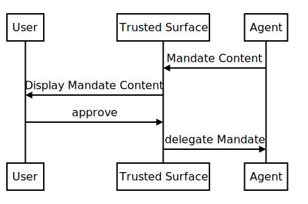
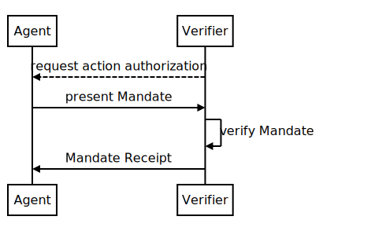
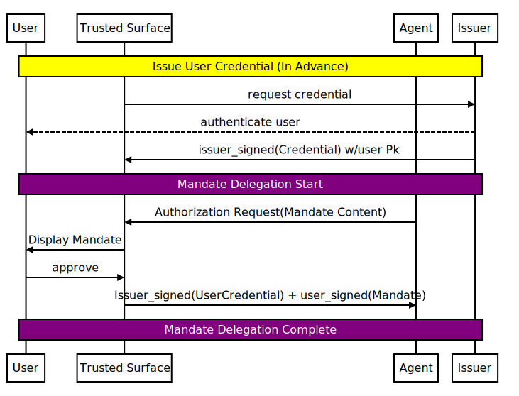
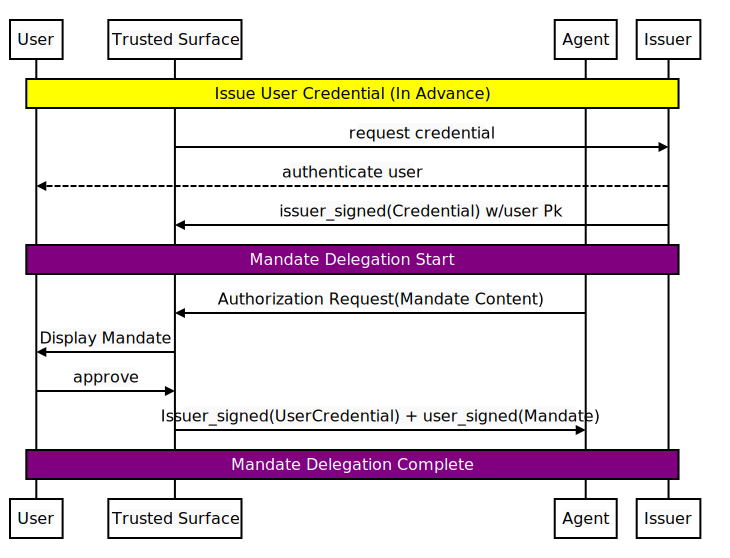

# Agent Authorization

Due to their non-deterministic processes, even well-behaving Agents need to
have their behavior tightly constrained above what a normal authorization
model would require of human users.

In this document we provide a model for Agentic Authorization to provide
clarity to the final Verifier as to what the User approved the Agent to do.
AP2 makes use of this model for the payments use case, but the model could be
applied more generally in the future.

The authorization process is broken into two steps:

  - **Mandate Delegation**: A User authorizes an Agent to perform some action
    (or actions) on their behalf. This is done by having the User approve the
    Mandate Content on a Trusted Surface and delegate the resulting Mandate to
    the Agent.
  - **Action Authorization**: Here a Verifier challenges an Agent to provide
    proof that it is authorized to perform an action on behalf of a User. The
    Agent does so by presenting a relevant Mandate to the Verifier. Upon
    completion, the Verifier returns the Agent a Receipt.

<div style="display: flex; justify-content: space-around;">
  <figure>
    
    <figcaption align="center">Mandate Delegation</figcaption>
  </figure>
  <figure>
    
    <figcaption align="center">Action Authorization</figcaption>
  </figure>
</div>

## Mandate Delegation

Mandate Delegation is performed as follows:

  - The Agent creates Mandate Content that it wishes to be authorized by the User.
  - The User is shown the Mandate Content on a Trusted Surface.
  - After authorization and consent from the user, a Mandate is created and
    passed back to the Agent.
  - The Agent stores the Mandate for future use.

This document defines the following models for Mandate Delegation:

  - User Credential
  - Trusted Agent Provider

The User Credential approach makes use of an Issuer external to the Agent that
the Verifier trusts to guarantee the Trusted Surface. This has the benefit
of a single User Credential being able to delegate Mandates to many different
Agents, without the Verifier needing to have an explicit trust relationship with
each Agent.

The Trusted Agent Provider approach makes the provider of the Agent
the party trusted by the Verifier. This allows for a simpler trust model, but
requires Verifiers to establish trust with every Agent Provider. An Agent
Provider could also be an Issuer of User Credentials, blending the two
approaches.

> NOTE:
> In the future, other approaches to establishing trust in the Delegated
> Mandates can be explored. The Mandate Content itself functions independent
> of the means used to establish trust in its integrity.
>
> Some other models include a directly trusted user key, rather than a full
> credential, such as a passkey or hardware-attested key.

### User Credential

This is a three-party model involving:

  - The User Credential Issuer
  - The Trusted Surface as a Holder of the User Credential
  - The Agent

In this model, the Issuer of the User Credential is being trusted by the Verifier
to ensure that the Trusted Surface constructs Mandates only after obtaining
appropriate user consent and authorization.

<figure>
  
  <figcaption align="center">Mandate Delegation: User Credential</figcaption>
</figure>

In advance of this flow, the Issuer issues the User
Credential to the Holder. The mechanism for issuance is outside the scope of
this document; one standard approach can be seen in the [OpenID4VCI](#references)
specification.

This model performs the creation and delegation of the mandate as part of the
presentation of a User's VDC.

> NOTE:
> While this document specifies using OpenID4VP with SD-JWT VCs, other VDC formats such as [ISO mDocs (ISO18013-5)](#references) and protocols such as [18013-7 Annex C](#references) could be made to fulfill the same role.

#### Delegation using OpenID4VP

[OpenID4VP](#references) provides a standard protocol for presenting VDCs
from a holder to a verifier. One feature of the protocol is `transaction_data`,
which allows additional information to be approved and signed by the holder of
the digital credential.

To perform User Credential Delegation with OpenID4VP, the Agent constructs an Authorization Request where the `transaction_data` array contains base64url-encoded JSON objects. The mandate delegation object MUST contain the following properties before encoding:

  - **type**: **REQUIRED**. MUST be the string value "*delegate*".
  - **format**: **REQUIRED**. The required VDC format of the returned Mandate.
  - **delegate_payload**: **REQUIRED**. An array containing the Mandate Content
    payloads as JSON Objects.
  - **delegate_disclosures**: **OPTIONAL**. An array that contains any Selective
    Disclosures in the `delegate_payload`.

When constructing the Authorization Response, the `delegate_payload` MUST be
included as part of the Key Binding. See [Delegate SD-JWT](#references) for details.

Other fields in the Authorization Request MAY be set as normal, such as using
the DCQL query to specify the required User Credential.

It is RECOMMENDED to use the Digital Credentials API for delegation with
OpenID4VP where available to provide higher security and the best quality user
experience.

Below is a non-normative example of an OpenID4VP Authorization Request to
delegate Checkout and Payment Mandates. Base64url-encoded strings are truncated for readability.

```json
{
  "requests": [
    {
      "protocol": "openid4vp-v1-unsigned",
      "data": {
        "response_type": "vp_token",
        "response_mode": "dc_api",
        "nonce": "b5d4e074-dff5-4cd5-a506-f09dd6f2e33a",
        "dcql_query": {
          "credentials": [
            {
              "id": "dpc_credential",
              "format": "dc+sd-jwt",
              "meta": {
                "vct_values": ["com.emvco.dpc"]
              },
              "claims": [
                { "path": ["card_last_four"] },
                { "path": ["card_network_code"] },
                { "path": ["credential_id"] }
              ]
            }
          ]
        },
        "transaction_data": [
          "eyJ0eXBlIjoicGF5bWVudF9jYXJkIiwiY3JlZ...<truncated_payment_card_base64>...5MDBcIn0ifQ==",
          "eyJ0eXBlIjoiZGVsZWdhdGUiLCJmb3JtYXQiO...<truncated_delegate_base64>...aGEtMjU2Il19"
        ],
        "client_metadata": {
          "client_id_scheme": "x509_san_dns",
          "vp_formats": {
            "dc+sd-jwt": {
              "sd-jwt_alg_values": ["ES256"],
              "kb-jwt_alg_values": ["ES256"]
            }
          }
        }
      }
    }
  ]
}
```

**Decoded `transaction_data` Payloads (Informative)**

The `transaction_data` array contains two base64url-encoded JSON objects:

**Index 0 — Payment Card (UI Data)**: Defines the confirmation UI displayed to
the user before they approve the payment.

```json
{
  "type": "payment_card",
  "credential_ids": ["dpc_credential"],
  "transaction_data_hashes_alg": ["sha-256"],
  "merchant_name": "Generic Merchant",
  "amount": "USD 150.00",
  "additional_info": "{\"title\":\"Please confirm your purchase details...\",\"tableHeader\":[\"Name\",\"Qty\",\"Price\",\"Total\"],\"tableRows\":[[\"Adult Holland Lop Rabbit\",\"1\",\"150.00\",\"150.00\"]],\"footer\":\"Your total is 150.00\"}"
}
```

**Index 1 — Delegate (Cryptographic Mandates)**: Binds the payment to the
specific Checkout and Payment Mandate content via the `delegate_payload`.

```json
{
  "type": "delegate",
  "format": "dc+sd-jwt",
  "credential_ids": ["dpc_credential"],
  "transaction_data_hashes_alg": ["sha-256"],
  "delegate_payload": [
    {
      "vct": "mandate.checkout.1",
      "checkout_jwt": "eyJhbGciOiJFUzI1NiIs...<Merchant_Checkout_JWT>",
      "checkout_hash": "3WiKMabE8NRYJgveUbyAZ3pBqRfPrWwGDbOyvbO1eYA",
      "cnf": {
        "jwk": {
          "kty": "EC",
          "crv": "P-256",
          "use": "sig",
          "x": "c09-Eo2PvuO6VrfzLAxTZXBa3ZWkBaa0pR2jcOYKlw",
          "y": "gRETv5wMvNiZJqckokCyDAjIIEg3Y2m77VryMvS75Ww"
        }
      }
    },
    {
      "vct": "mandate.payment.1",
      "transaction_id": "3WiKMabE8NRYJgveUbyAZ3pBqRfPrWwGDbOyvbO1eYA",
      "payment_amount": { "amount": 15000, "currency": "USD" },
      "payee": {
        "id": "merchant_1",
        "name": "Generic Merchant",
        "website": "https://demo-merchant.example"
      },
      "payment_instrument": {
        "id": "b3f1c8a2-6d4e-4f9a-9e3d-8a7c2f1b9d34",
        "type": "dpc",
        "description": "DPC ···· 4444"
      }
    }
  ]
}
```

Below is a non-normative OpenID4VP Authorization Response containing the
user-signed Checkout and Payment Mandates. Long strings have been truncated for readability.

```json
{
  "protocol": "openid4vp-v1-unsigned",
  "data": {
    "vp_token": {
      "dpc_credential": [
        "eyJhbGci...<truncated_issuer_jwt>...jA~WyJiWk5w...<truncated_disclosure_1>...Q~WyJCdThH...<truncated_disclosure_2>...Q~WyJNUThs...<truncated_disclosure_3>...Q~eyJ0eXAi...<truncated_key_binding_jwt>...jZ"
      ]
    }
  }
}
```

The `dpc_credential` is a `~`-separated SD-JWT. The decoded components are:

**Core SD-JWT Payload (Issuer Credential)**

```json
{
  "iss": "https://digital-credentials.dev",
  "vct": "com.emvco.dpc",
  "iat": 1683000000,
  "exp": 1883000000,
  "_sd_alg": "sha-256",
  "_sd": [
    "0ygSIMbyCz_SAL7CrZeDg_C3AnqJVgf35I1t1ie0RZs",
    "1ipSejAAw_lASOeNsGbj3R_3MZNRtalgU9MYvc73Z5g",
    "3d_ksLaY7NAyu9PQZodRB4XsqF2jquCsl2avOlnWCn8",
    "PBhW42ATJqcs3_odVhHuTGEDhN7idDmZMLLORR-lAec"
  ],
  "cnf": {
    "jwk": {
      "kty": "EC",
      "crv": "P-256",
      "x": "8jBWriuJBY--u__2jOJfcX4Jj4kEqY4CUX9cf1bQddY",
      "y": "csH2kOGhlemhRRuPUYFKJYZgVqEXQh2JfotRKGRMfLE"
    }
  }
}
```

**Selective Disclosures** (Only the three claims requested by the merchant are
revealed; remaining fields stay hidden in the undisclosed `_sd` hashes):

```json
[
  ["bZNpmTeoL5tYU7gKTVkTUA", "card_last_four", "4444"],
  ["Bu8Gie949nAgBdL6B657Mw", "card_network_code", "ACME"],
  ["MQ8lrNkAwYlavMT8own4DA", "credential_id", "b3f1c8a2-6d4e-4f9a-9e3d-8a7c2f1b9d34"]
]
```

Multiple Mandate Delegations MAY be requested in a single Authorization Request
by providing multiple elements in the `delegate_payload` array.

### Trusted Agent Provider

In this model, the Agent Provider is being trusted by Verifiers directly to
construct Mandates only after obtaining appropriate user consent and
authorization. This model does not require a pre-issued credential. The
following steps occur:

<figure>
  
  <figcaption align="center">Mandate Delegation: Trusted Agent Provider</figcaption>
</figure>

  - The Agent constructs the Mandate Content and passes it to a Trusted Surface
    controlled by the Agent Provider.
      - *For example another, deterministic, part of their application.*
  - The Agent Provider’s Trusted Surface displays the Mandate Content to the
    user and obtains any necessary user authorization and consent.
  - The Agent Provider uses a securely stored signing key to create the Mandate.
      - *For example, by having the Trusted Surface communicate with the Agent
        Provider backend to have the mandate signed.*

The Agent Provider MUST ensure that the Agent is not able to access the
Agent Provider signing key, or use it without the Trusted Surface. See
Security and Privacy Considerations for more details of the risks.

Below is a non-normative example of an Agent Provider creating a Checkout
Mandate as an `sd-jwt-vc` payload.

*Decoded Top-Level Payload:*
```json
{
  "iss": "https://agent-provider.example.com",
  "vct": "com.example.agent_mandate",
  "iat": 1777326189,
  "_sd_alg": "sha-256",
  "delegate_payload": [
    { "...": "4UrKesfj0IT5_OE7zLYlXHkAwPbC3JvJgIxku3uq0EE" }
  ]
}
```

*Decoded Disclosure (The Open Mandate):*
The hash ending in `uq0EE` reveals the mandate. Notice how the acceptable items and allowed merchants are also hidden behind hashes inside the constraints array:
```json
[
  "8rGxzvzfSEW7fw4nb_dYx_w",
  {
    "vct": "mandate.checkout.open.1",
    "cnf": { "jwk": { "crv": "P-256", "kty": "EC", "x": "7MAQoKtK...", "y": "i3OUjGXe..." } },
    "iat": 1777326189,
    "exp": 1777329789,
    "constraints": [
      {
        "type": "checkout.line_items",
        "items": [
          {
            "id": "line_1",
            "quantity": 1,
            "acceptable_items": [
              { "...": "LqZRRzN7nzxJCVf0kP5OvvWvits5CcATHkoq_xGoz8s" }
            ]
          }
        ]
      },
      {
        "type": "checkout.allowed_merchants",
        "allowed": [
          { "...": "UZSGFNQpapJSRQLCeVDfqGzfMCUiJvLL80_kcDai_OI" }
        ]
      }
    ]
  }
]
```

*Decoded Disclosures (Nested Array Items):*
The Agent can selectively disclose the specific line item and merchant authorized by the constraints array above:
```json
[
  "vK5dz2nnVpgtoC9dZy9uHw",
  {
    "id": "supershoe_limited_edition_gold_sneaker_womens_9_0",
    "title": "SuperShoe Limited Edition Gold"
  }
]
```
```json
[
  "NAhMECHMBjd978UDQqsAYA",
  {
    "id": "merchant_1",
    "name": "Demo Merchant",
    "website": "https://demo-merchant.example"
  }
]
```

## Mandate Structure

Mandates form a cryptographically verifiable chain from the original
user-approved Mandate through to the closed Mandate used to authorize a
particular Verifier’s action.

Mandates can be thought of being in two states:

  - **Closed**: When the Mandate is bound to a particular transaction with a
    Verifier to authorize the agent to perform an action. This is achieved by the Agent generating a Key Binding JWT (Proof-of-Possession) using the key endorsed in the open Mandate's `cnf` claim.
  - **Open**: When the Mandate has not yet been bound to a particular
    transaction. It instead has a set of constraints on the valid content for
    the closed Mandate, as well as being bound to a particular Agent who is
    allowed to use the Mandate.

Open Mandates are necessary to allow the Agent to perform autonomous actions on
the User’s behalf, while still appropriately constraining their behavior.

<figure>
  
  <figcaption align="center">Example: Mandate Chains</figcaption>
</figure>

The above diagram illustrates two examples of a Mandate providing human
authorization of the same action (doX with A). In the ‘Human Present’ case, the
User directly signs closed Mandate Content, while in the second case, the User signs
open Mandate Content. The Agent then signs closed Mandate Content on the user’s behalf,
and provides the entire Mandate chain to demonstrate the authorization.

Because Open Mandates need to be bound to a particular transaction before use,
they MUST support cryptographic Key Binding.

### Mandates using SD-JWT VCs

[SD-JWT](#references)s provide a convenient structure for cryptographically securing JSON and a
number of useful properties for Mandates:

  - The Key Binding mechanism allows for the Agent to provide Proof-of-Possession
    and transaction binding when the user is no longer present.
  - Selective Disclosure can be used to preserve User privacy while providing
    the Agent flexibility in decision making by only disclosing the applicable
    parts of the constraint.

> NOTE:
> While this document uses SD-JWT VCs, other VDCs such as ISO mDocs COULD
> be used in their place.

The Mandate Content for SD-JWTs contains the following claims:

  - *vct*: **REQUIRED**. A String uniquely identifying the Mandate Type, in
    addition to the credential type.
  - *constraints*: **OPTIONAL**. An array of extensible Objects
    providing Constraints on what is allowed to be present in the closed Mandate.
      - *type*: **REQUIRED**. A unique String identifying this constraint.
      - Other properties are present based on the constraint type.
  - *cnf*: **OPTIONAL**. Contains the confirmation method identifying the Proof-of-Possession key as
    defined in [RFC7800](#references). This claim is **REQUIRED** if the Mandate is still open.

Other properties MAY be included in the Mandate based on the Mandate Type. A
Mandate that is still open is NOT REQUIRED to have all of the required fields of a
particular Mandate Type, but the eventually closed Mandate MUST include them.
Additionally, any claim in SD-JWT-VC MAY also be used.

The AP2 specification provides mandate types and constraint types for use with
payments. New mandate types and new constraint types MAY be defined in addition
to these to meet other use cases. It is RECOMMENDED to use a collision-resistant
naming approach, for example via a rDNS prefix controlled by the specifying
entity, or an appropriate URN.

#### Verification and Processing Rules

The verification and processing rules for a chain of SD-JWT mandates are as
follows:

  1. Verify and process the SD-JWT chain according to [Delegate SD-JWT](#references).
  2. Extract claims from open Mandate Content and verify the closed Mandate
     Content has these values unchanged.
  3. Extract each Constraint from each open Mandate Content and evaluate them
     against the closed Mandate Content based on the Constraint Type.
     - Any unknown Constraints MUST be treated as failing evaluation.

## Action Authorization

Action Authorization happens between an Agent and a Verifier. It is performed
when a Verifier needs an Agent to prove that it has the appropriate
authorization to perform a particular action (such as executing a purchase).

Action Authorization is performed as follows:

1.  The Verifier and the Agent interact until the Verifier needs proof of human
    authorization from the Agent.
2.  The Verifier requests a Mandate to be presented that will demonstrate that
    the Agent is authorized to perform that action.
3.  The Agent selects an appropriate Mandate and presents it to the Verifier. If
    the Mandate is open, then the Agent uses the key endorsed by that Mandate to
    bind it to the transaction.
4.  The Verifier verifies both the integrity of the Mandate and that the
    Mandate Content allows the Agent to perform the action that they wish to
    perform.

As part of presenting a Mandate, if it contains selective disclosures, the Agent
MUST choose which disclosures to include so as to maximize user privacy while
still providing authorization.

*Note: the mechanism of selecting the appropriate Mandate is an implementation
detail of the Shopping Agent and outside the scope of this specification.*

The Verifier performs Verification of the Mandate (see
[Verification](#verification-and-processing-rules)).

Upon acceptance or rejection of the Mandate, the Verifier MUST return a signed
Mandate Receipt.
Upon receipt of a successful Mandate Receipt, the Agent stores the
open Mandate-closed Mandate-Mandate Receipt tuple. The agent reduces the scope
of the open mandate based on the receipt, often preventing future presentations
entirely.

A Mandate Receipt is a Verifier-signed JWT with the following properties:

  - *iss*: **REQUIRED**. A String containing the issuer of the JWT, which
    MUST be the Verifier.
  - *result*: **REQUIRED**. An Enum with value `["success", "error"]`
    indicating the result of the action authorization.
  - *reference*: **REQUIRED**. A String value that is the base64url-encoded
    hash of the received Mandate. When receiving a chain of Mandates, it is
    a hash over the final SD-JWT in the chain. It is calculated in the same
    manner as `sd_hash`. The algorithm used MUST be the same as the
    `_sd_alg` specified for the SD-JWT, or `sha-256` if not specified.
  - *error*: **OPTIONAL**. A String error code identifying the error. MUST be
    present when the result is `"error"`.
  - *error_description*: **OPTIONAL**. A human-readable error description String.

It MAY contain additional use-case specific properties, based on the action that
was authorized, and the Mandate Type received.

### Errors
The following errors are defined for all action authorizations:

  - `invalid_credential`: Returned when the Mandate fails verification. This
    represents a terminal error.
  - `unresolved_constraint`: Returned when the Mandate contains an unknown
    constraint, or the Verifier is unable to verify that the closed Mandate conforms to the
    provided constraints. This MAY be used as a signal to fallback
    to either a directly approved closed Mandate, or other non-agentic
    flows.
  - `invalid_mandate`: Returned when the provided Mandate fails to approve the
    requested action. This represents a terminal error.
  - `mandates_not_supported`: Indicates that the Verifier does not support
    mandates for approving this action. This MAY be used as a signal to fallback
    to non-agentic flows.

## References

### Normative

- [OpenID4VP]: T. Lodderstedt, K. Yasuda, T. Looker. "[OpenID for Verifiable Presentations](https://openid.net/specs/openid4vp-1_0.html)", OpenID Foundation, 2024.
- [SD-JWT]: D. Fett, B. Campbell, K. Yasuda, M. B. Jones. "[Selective Disclosure for JWTs (SD-JWT)](https://datatracker.ietf.org/doc/rfc9901/)", February 2025.
- [Delegate SD-JWT]: G. Oliver. "[Delegate SD-JWT (Individual Draft)](https://github.com/GarethCOliver/gco-delegate-sd-jwt)", 2026.
- [RFC7800]: M. B. Jones, J. Bradley, H. Tschofenig. "[Proof-of-Possession Key Semantics for JSON Web Tokens (JWTs)](https://datatracker.ietf.org/doc/html/rfc7800)", April 2016.

### Informative

- [OpenID4VCI]: T. Lodderstedt, K. Yasuda, T. Looker. "[OpenID for Verifiable Credential Issuance](https://openid.net/specs/openid4vc-issuance-1_0.html)", OpenID Foundation, 2024.
- [ISO18013-5]: ISO/IEC JTC 1/SC 17. "[ISO/IEC 18013-5:2021 Personal identification — ISO-compliant driving licence — Part 5: Mobile driving licence (mDL) application](https://www.iso.org/standard/69084.html)", September 2021.
- [ISO18013-7]: ISO/IEC JTC 1/SC 17. "[ISO/IEC 18013-7:2024 Personal identification — ISO-compliant driving licence — Part 7: Mobile driving licence (mDL) add-on functions](https://www.iso.org/standard/82763.html)", October 2024.
