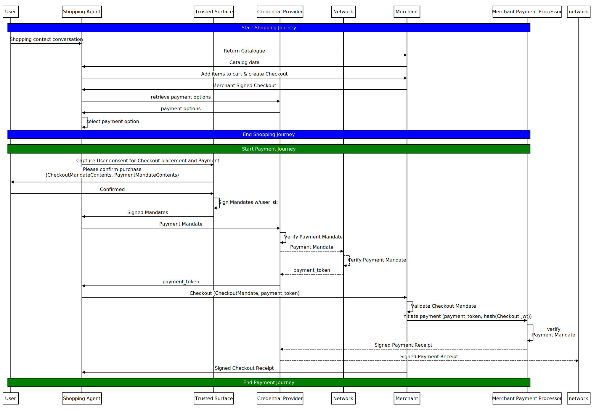
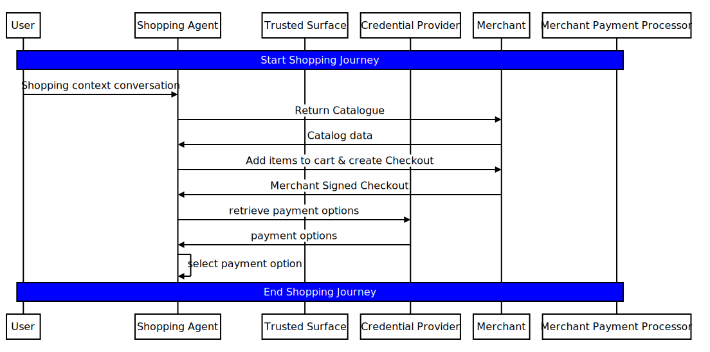
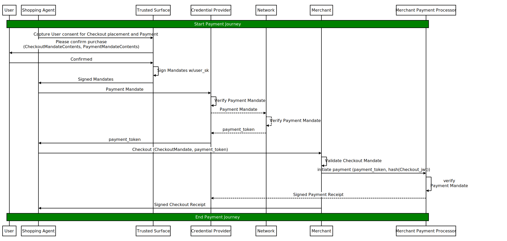
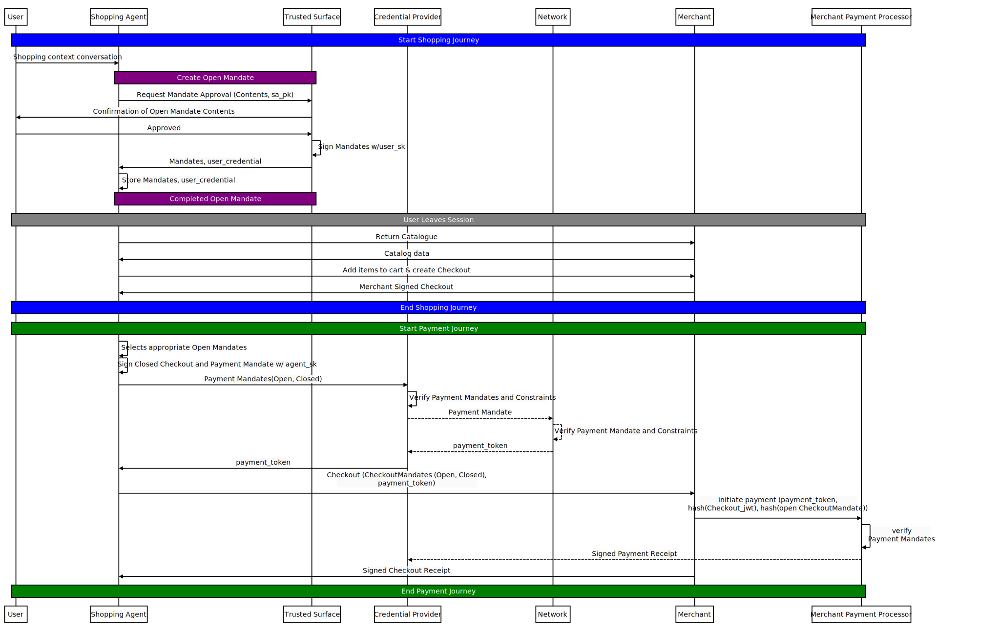
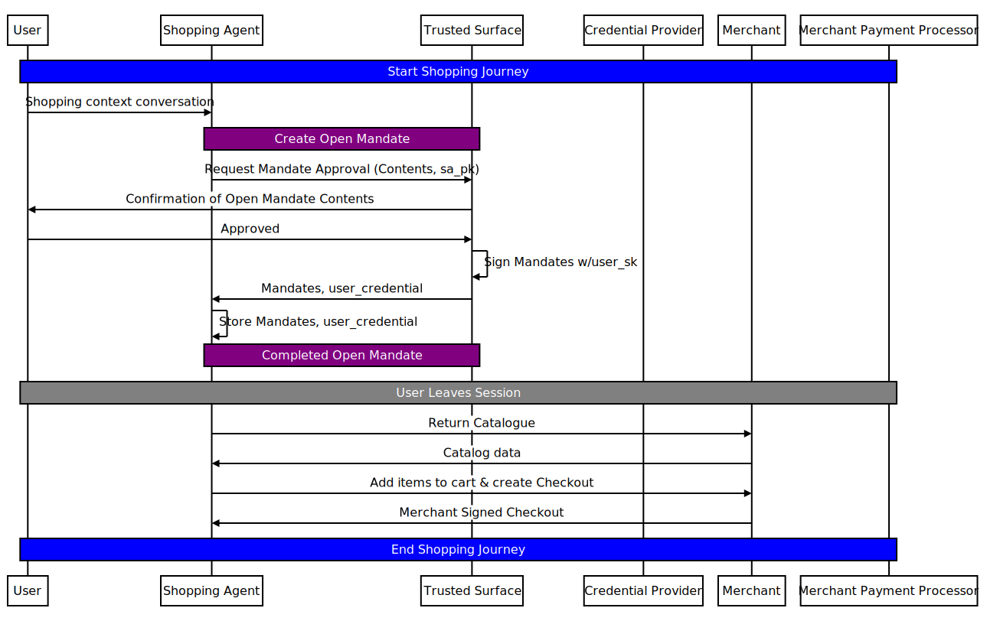
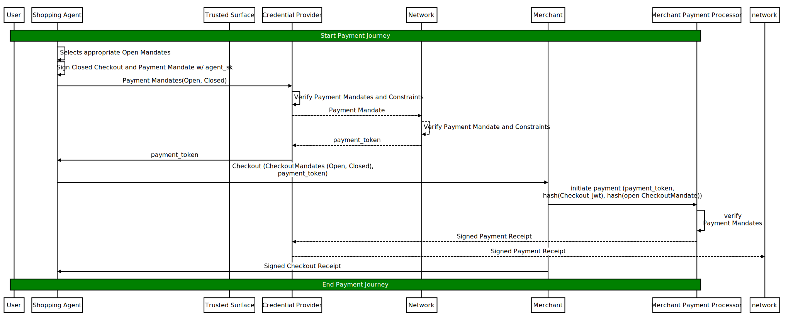

# Flow Examples

There are two categories of flows in AP2: Human Present and Human Not Present.

  - *Human Present*: The User **directly** approves the closed Checkout and
    Payment Mandates.
  - *Human Not Present*: The User approves open Checkout and Payment Mandates
    while the Agent, acting autonomously, presents them along with Agent-signed
    closed Checkout and Payment Mandates.

A Human Not Present flow can be turned into a Human Present flow by the Merchant
(or Credential Provider) returning an `unresolved_constraint` error and
bringing the User back into the loop to approve the closed Mandates.

All flows below are non-normative examples. They assume that appropriate
enrollment and any necessary User Credentials have been set up in advance.

## Human Present

This is the `direct` flow where the User is present to directly approve the
closed Payment and Checkout Mandates.

<figure>
  
  <figcaption align="center">Human Present flow</figcaption>
</figure>

There are two phases to this flow:

**Phase 1: Shopping**

<figure>
  
  <figcaption align="center">Human Present Shopping flow</figcaption>
</figure>

  1. User initiates shopping with the Shopping Agent.
  2. The Shopping Agent communicates with the Merchant and assembles a cart.
  3. The Shopping Agent goes to Checkout. The Merchant creates a signed Checkout
     and requires an appropriate mandate to continue.
  4. The Shopping Agent retrieves existing Instrument Options from the Credential
     Provider and selects one.

**Phase 2: Payment**

<figure>
  
  <figcaption align="center">Human Present Payment flow</figcaption>
</figure>

  1. The Shopping Agent constructs Payment and Checkout Mandate Content and
     requests user approval via a Trusted Surface.
     - *This could use an external Trusted Surface with the User Credential
       model, or an internal one using the Trusted Agent Provider model.*
  2. The Trusted Surface renders the Mandate Content and obtains user
     authentication (e.g., biometric) and consent.
  3. The Trusted Surface uses `user_sk` to sign and create the Payment Mandate
     and Checkout Mandate.
     - *The `checkout_jwt` hash is used to permanently link the Mandates.*
     - *The `user_sk` would be the Agent Provider's key in the Trusted Agent
       Provider model.*
  4. The Trusted Surface passes the Mandates back to the Shopping Agent.
  5. The Shopping Agent passes the Payment Mandate to the Credential Provider,
     who verifies it and creates a payment token.
     - *As part of this process, the Credential Provider may share the Payment
       Mandate with the payment network and receive a scoped purchase credential
       (also called a token).*
  6. The Shopping Agent sends this token and the Checkout Mandate to the
     Merchant.
  7. The Merchant verifies the integrity and content of the Checkout Mandate
     against the current cart state, then initiates the payment with the token
     and `checkout_jwt` hash.
  8. The Merchant Payment Processor verifies the included Payment Mandate in the
     token and the binding with the `checkout_jwt` hash.
  9. The MPP-signed Payment Receipt is returned to the Shopping Agent,
     Credential Provider, and Network, and the Merchant-signed Checkout Receipt
     is returned to the Shopping Agent to indicate success.

## Human Not Present

<figure>
  
  <figcaption align="center">Human Not Present flow</figcaption>
</figure>

**Phase 1: Shopping**

In the Human Not Present flow, the Shopping phase is split in two. In the first
phase, the User sets a shopping task for the Agent. In the second phase, the
Agent acts autonomously to complete the task without further human interaction.

<figure>
  
  <figcaption align="center">Human Not Present Shopping flow</figcaption>
</figure>

**Phase 1a: Shopping (Human Present)**

In this phase, the User provides the agent authorization for autonomous commerce
in the form of open Checkout and Payment Mandates.

  1. User initiates shopping with the Shopping Agent.
  2. The Shopping Agent assembles the appropriate `open` Mandate Contents for the
     shopping session and requests user approval via a Trusted Surface.
     - *This defines a set of constraints where the Shopping Agent can act
       without requiring further User authorization.*
  3. The Trusted Surface renders the Mandate Content and obtains user
     authentication (e.g., biometric) and consent.
  4. The Trusted Surface uses the `user_sk` to sign and create the open Checkout
     and open Payment Mandates.
     - *The hash of the open Checkout Mandate is included in the open Payment
       Mandate to permanently link them.*
     - *The `agent_pk` is included as a confirmation claim to sender-constrain
       the Mandate usage.*
     - *The `user_sk` would be the Agent Provider key in the Trusted Agent
       Provider model.*

The User now leaves the session, having delegated the shopping task to the
Shopping Agent.

**Phase 1b: Shopping (Human Not Present)**

In this phase, the Agent autonomously assembles a Checkout it believes fulfills
the assigned task.

  1. The Shopping Agent communicates with the Merchant and assembles a cart.
  2. The Shopping Agent goes to Checkout. The Merchant creates a signed Checkout
     and requires an appropriate mandate to continue.

**Phase 2: Payment (Human Not Present)**

In this phase, the Agent completes the checkout using the provided Mandates.

<figure>
  
  <figcaption align="center">Human Not Present Payment flow</figcaption>
</figure>

  1. The Shopping Agent selects the appropriate existing open Mandates whose
     constraints apply to the incoming Checkout.
     - *The Mandate selection mechanism is outside the scope of this
       specification.*
     - *To prevent double-spend, the Shopping Agent MUST NOT create multiple
       overlapping Mandates until it receives an Action Receipt indicating an
       error. See the Implementation Considerations section for more details.*
  2. The Shopping Agent constructs the Payment and Checkout Mandate Contents and
     signs both closed Mandates using the `agent_sk`.
     - *The `checkout_jwt` hash is used to permanently link them.*
     - *The `sd_hash` property of the `kb-sd-jwt` is used to bind the closed
     mandate to the open one*
  3. The Shopping Agent passes the Payment Mandates (Open and Closed) to the
     Credential Provider, who verifies them and creates a payment token.
     - *As part of this process, the Credential Provider may share the Payment
       Mandate with the payment network and receive a scoped purchase credential
       (also called a token).*
  4. The Shopping Agent sends this token and the Checkout Mandates (Open and
     Closed) to the Merchant.
  5. The Merchant verifies the integrity and content of the closed Checkout
     Mandate against the current cart state, and verifies that the constraints
     in the open Checkout Mandate have been met. It then initiates the payment
     with the token, `checkout_jwt` hash, and open Checkout Mandate hash.
  6. The Merchant Payment Processor verifies the included Payment Mandates in the
     token, as well as the bindings with the `checkout_jwt` hash and open
     Checkout Mandate hash.
  7. The MPP-signed Payment Receipt is returned to the Shopping Agent,
     Credential Provider, and Network, and the Merchant-signed Checkout Receipt
     is returned to the Shopping Agent to indicate success.
