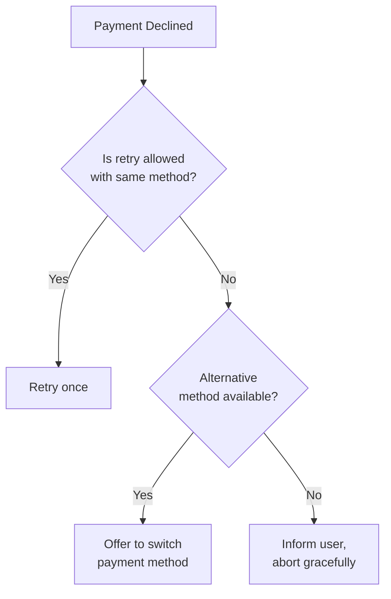
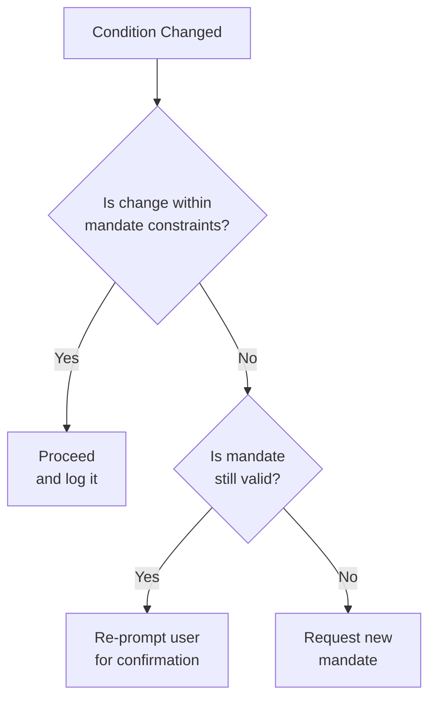

# Handling Failure States in Agent Payment Flows

## Overview

Agent payment flows operate in dynamic environments where conditions can change
between steps. This document provides guidance on how agents should detect,
communicate, and recover from common failure scenarios while respecting user
intent and mandate constraints.

## Guiding Principles

1. **Mandate as Contract**: The mandate represents the user's informed consent.
   Agents must not exceed mandate constraints without explicit user
   re-confirmation.

2. **Fail Safely**: When in doubt, pause and confirm with the user rather than
   proceeding with a potentially unauthorized transaction.

3. **Transparent Communication**: Failure states should be communicated clearly
   with actionable recovery options.

4. **No Silent Degradation**: Agents should never silently accept worse terms
   than what the user originally approved.

---

## Failure Scenarios

### 1. Mandate Expiration

**When it occurs:** The `intent_expiry` (IntentMandate) or `cart_expiry`
(CartMandate) timestamp is reached before the transaction completes.

**Detection:**

```python
from datetime import datetime, timezone

def is_mandate_expired(expiry_iso: str) -> bool:
    """Check if a mandate has expired based on its expiry timestamp."""
    expiry = datetime.fromisoformat(expiry_iso)
    return datetime.now(timezone.utc) > expiry
```

**Expected Agent Behavior:**

| Scenario                                     | Action                                           |
| -------------------------------------------- | ------------------------------------------------ |
| Intent mandate expired before cart selection | Request new intent mandate from user             |
| Cart mandate expired before payment          | Request fresh cart from merchant                 |
| Expiry during payment authorization          | Abort, request fresh cart + re-confirm with user |

**Example Failure Response:**

```json
{
    "category": "MANDATE_EXPIRED",
    "message": "Cart mandate expired at 2025-01-15T10:30:00Z",
    "recovery_action": "NEW_MANDATE_REQUIRED",
    "details": {
        "mandate_type": "CartMandate",
        "expired_at": "2025-01-15T10:30:00Z",
        "cart_id": "cart_abc123"
    }
}
```

**Guidance:**

- **Do**: Inform user: _"Your cart reservation has expired. Would you like me
    to get a fresh quote?"_
- **Do**: Preserve user's original intent for easier re-creation
- **Don't**: Proceed with expired mandate

---

### 2. Price Drift Beyond Mandate Constraints

**When it occurs:** The final price from the merchant exceeds what the user
originally approved or exceeds explicit price constraints in the mandate.

**Common causes:**

- Dynamic pricing changes between browse and checkout
- Tax calculation differences
- Currency fluctuations
- Surge pricing (travel, delivery)

**Detection:**

```python
def check_price_drift(
    original_total: float,
    current_total: float,
    tolerance_percent: float = 0.0
) -> tuple[bool, float]:
    """
    Check if price drift is within acceptable tolerance.

    Returns:
        (is_within_tolerance, drift_percent)
    """
    if original_total == 0:
        return (current_total == 0, 0.0)
    drift_percent = ((current_total - original_total) / original_total) * 100
    return (drift_percent <= tolerance_percent, drift_percent)
```

**Expected Agent Behavior:**

| Drift Amount                    | Action                                                 |
| ------------------------------- | ------------------------------------------------------ |
| Within tolerance (if specified) | Proceed with informational note                        |
| Exceeds tolerance but < 10%     | Pause, confirm with user before proceeding             |
| Exceeds 10% or max_amount       | Abort, present new price to user for explicit approval |

**Example Failure Response:**

```json
{
    "category": "PRICE_DRIFT",
    "message": "Final price exceeds original quote by 15%",
    "recovery_action": "USER_CONFIRMATION_REQUIRED",
    "details": {
        "drift_percent": 15.0,
        "tolerance_percent": 5.0
    },
    "original_value": { "amount": 100.0, "currency": "USD" },
    "actual_value": { "amount": 115.0, "currency": "USD" }
}
```

**Guidance:**

- **Do**: _"The price has increased from $100 to $115. Would you like to
    proceed?"_
- **Do**: Offer alternatives: _"I found a similar item at [Merchant B] for
    $98"_
- **Don't**: Silently pay higher price
- **Don't**: Round down or hide the difference

---

### 3. Payment Decline / PSP Rejection

**When it occurs:** The payment service provider (PSP) or issuer declines the
transaction.

**Common decline reasons:**

| Reason Code          | Description                  | User Action Required                    |
| -------------------- | ---------------------------- | --------------------------------------- |
| `INSUFFICIENT_FUNDS` | Account lacks funds          | Yes - add funds or use different method |
| `CARD_EXPIRED`       | Payment method expired       | Yes - update payment method             |
| `CVV_MISMATCH`       | Security code incorrect      | Yes - re-enter details                  |
| `RISK_REJECTED`      | Fraud/risk rules triggered   | Maybe - contact issuer                  |
| `SCA_REQUIRED`       | Strong authentication needed | Yes - complete 3DS/biometric            |
| `LIMIT_EXCEEDED`     | Transaction limit hit        | Yes - adjust or use different method    |

**Expected Agent Behavior:**



**Example Failure Response:**

```json
{
    "category": "PAYMENT_DECLINED",
    "message": "Payment declined: Insufficient funds",
    "recovery_action": "ALTERNATIVE_PAYMENT_REQUIRED",
    "decline_code": "INSUFFICIENT_FUNDS",
    "details": {
        "retry_with_same_method": false,
        "alternative_methods_available": true
    }
}
```

**Guidance:**

- **Do**: _"Your payment was declined due to insufficient funds. Would you
    like to try a different payment method?"_
- **Do**: If user has multiple saved methods, offer to switch
- **Don't**: Retry indefinitely
- **Don't**: Expose sensitive decline details to merchant

---

### 4. Partial Cart Rejection / Out of Stock

**When it occurs:** The merchant cannot fulfill all items in the cart (inventory
changes, discontinued items, regional restrictions).

**Expected Agent Behavior:**

| Scenario                         | Action                                      |
| -------------------------------- | ------------------------------------------- |
| Some items unavailable           | Present modified cart, re-confirm with user |
| All items unavailable            | Inform user, offer alternatives or abort    |
| Price changed on available items | Treat as price drift (see above)            |

**Example Failure Response:**

```json
{
    "category": "CART_MODIFIED",
    "message": "2 of 5 items are no longer available",
    "recovery_action": "USER_CONFIRMATION_REQUIRED",
    "rejected_items": [
        {
            "sku": "SKU-123",
            "reason": "OUT_OF_STOCK",
            "message": "Expected restock in 3 days"
        },
        {
            "sku": "SKU-456",
            "reason": "DISCONTINUED",
            "alternative_sku": "SKU-789"
        }
    ],
    "original_value": { "item_count": 5, "total": 150.0 },
    "actual_value": { "item_count": 3, "total": 89.0 }
}
```

**Guidance:**

- **Do**: _"2 items are out of stock. The updated cart total is $89.
    Proceed?"_
- **Do**: Offer to find alternatives for rejected items
- **Do**: If total drops significantly, confirm user still wants to proceed
- **Don't**: Silently remove items and charge

---

## Mandate Enforcement vs. User Re-prompting

### Decision Framework



### When to Enforce Silently (Proceed)

- Change is explicitly within mandate tolerance
- Change benefits the user (lower price, faster shipping)
- Change is purely cosmetic (product image updated)

### When to Re-prompt User

- Price increases beyond tolerance
- Items modified or substituted
- Delivery terms changed
- Any change that could reasonably affect user's decision

### When to Request New Mandate

- Original mandate expired
- Fundamental constraint violated (wrong merchant, wrong product category)
- User explicitly revoked mandate
- Multiple failed attempts to satisfy mandate

---

## Standard Error Response Structure

All agents SHOULD use the `FailureResponse` type from `ap2.types.errors` when
communicating failures to ensure consistent handling across the ecosystem.

```python
from ap2.types.errors import (
    FailureResponse,
    FailureCategory,
    RecoveryAction,
    FAILURE_RESPONSE_DATA_KEY
)

# Example: Creating a failure response
failure = FailureResponse(
    category=FailureCategory.PRICE_DRIFT,
    message="Price exceeds maximum allowed amount",
    recovery_action=RecoveryAction.USER_CONFIRMATION_REQUIRED,
    original_value={"max_amount": 100.00},
    actual_value={"final_price": 125.00}
)

# Include in A2A message
message_builder.add_data(FAILURE_RESPONSE_DATA_KEY, failure.model_dump())
```

### Recovery Action Reference

| Recovery Action                | Meaning               | Agent Behavior                       |
| ------------------------------ | --------------------- | ------------------------------------ |
| `PROCEED_WITH_NOTICE`          | Change is acceptable  | Continue, optionally inform user     |
| `RETRY_ALLOWED`                | Transient failure     | Retry the operation (with backoff)   |
| `USER_CONFIRMATION_REQUIRED`   | Terms changed         | Pause and get explicit user approval |
| `NEW_MANDATE_REQUIRED`         | Mandate invalid       | Request fresh mandate from user      |
| `ALTERNATIVE_PAYMENT_REQUIRED` | Payment method failed | Offer different payment method       |
| `ABORT_TRANSACTION`            | Unrecoverable failure | Terminate gracefully, inform user    |

---

## Summary: Agent Behavior Matrix

| Failure Type                 | Detection Point    | Default Action | User Interaction      |
| ---------------------------- | ------------------ | -------------- | --------------------- |
| Intent expired               | Before cart search | Abort          | Request new mandate   |
| Cart expired                 | Before payment     | Refresh cart   | Confirm new terms     |
| Price drift (in tolerance)   | Cart confirmation  | Proceed        | Informational only    |
| Price drift (over tolerance) | Cart confirmation  | Pause          | Explicit confirmation |
| Payment declined (can retry) | Payment response   | Retry once     | Inform if retry fails |
| Payment declined (terminal)  | Payment response   | Abort          | Offer alternatives    |
| Partial rejection            | Cart confirmation  | Pause          | Present modified cart |
| Full rejection               | Cart confirmation  | Abort          | Offer alternatives    |

---

## See Also

- [Life of a Transaction](life-of-a-transaction.md) - Normal flow without
    failures
- [Core Concepts](core-concepts.md) - Understanding mandates and their
    constraints
- [AP2 Specification](../specification.md) - Full protocol specification
