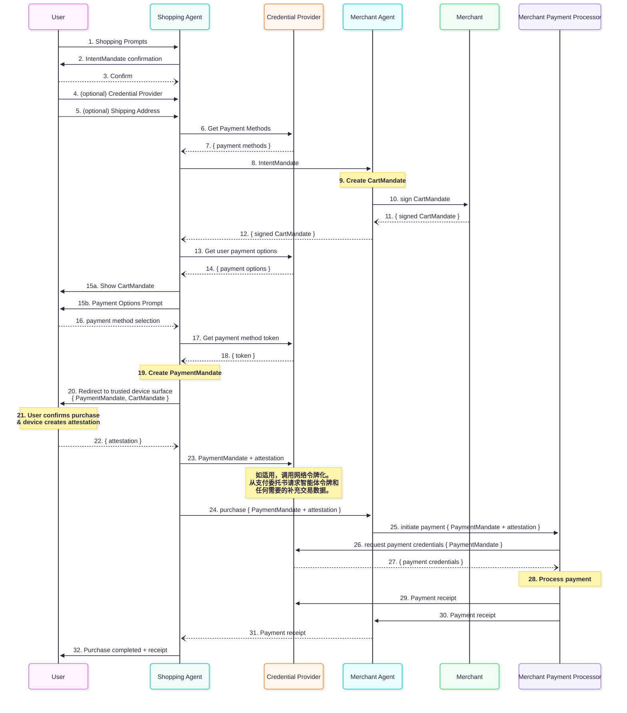

# 智能体支付协议 (AP2)：构建 AI 驱动支付的安全、可互操作未来

## 执行摘要

AI 智能体将重新定义数字商务格局，带来前所未有的便利性、个性化和效率。然而，这一
转变暴露了一个根本挑战：世界现有的支付基础设施并非为自主、非人类智能体代表用户行
事或彼此交易的未来而设计。当前的支付协议建立在与可信界面直接人类交互的假设之上，
缺乏安全验证智能体真实性和交易权限的机制。这暴露了对抗在线欺诈的长期防御，在交易
责任方面造成模糊性，并威胁到采用率，不仅是智能体商务，还对现有数字商务产生负面影
响。

没有通用、可信的协议，行业面临碎片化和不安全生态系统的前景，其特征是专有、孤立的
解决方案，增加了商户的复杂性，为用户造成摩擦，并阻止金融机构统一评估风险。为了解
决这一差距，本协议提出了智能体支付的开放、可互操作协议。该协议设计为新兴智能体间
通信 (A2A) 和模型上下文协议 (MCP) 的扩展，为 AI 驱动的商务建立了安全可靠的框架。

## 协作邀请：路线图和社区参与

这一智能体支付基础协议的成功取决于广泛的行业参与、反馈和公众支持。我们邀请商务和
支付生态系统中的所有利益相关方加入，共同完善和构建这一开放协议。

### 建议路线图

协议的开发和推出设想采用分阶段方法，使生态系统能够逐步构建、测试和采用功能。

-   **V0.1**: 初始规范专注于建立核心架构并启用最常见的用例。主要功能包括：
    -   支持"拉取式"支付方式（如信用卡/借记卡）
    -   基于 VDC 框架的明确定义数据载荷，以支持透明的责任归属
    -   支持用户在场场景
    -   支持用户和商户发起的升级质询
    -   详细的序列图和使用 [A2A 协议](https://a2a-protocol.org/) 的参考实现
-   **V1.x**: 后续版本将基于社区反馈和不断变化的需求扩展协议功能。潜在关注领域包
    括：
    -   全面支持"推送式"支付和所有支付方式（如实时银行转账、电子钱包等）
    -   循环支付和订阅的标准化流程
    -   支持用户不在场场景
    -   基于 MCP 实现的详细序列图
-   **长期愿景**: 长期来看，我们计划协议融入更多智能和灵活性，包括：
    -   对复杂多商户交易拓扑的原生支持
    -   支持买卖双方智能体之间的实时协商

我们相信，协作方法对于创建强大、安全且满足整个生态系统多样化需求的协议至关重要。
我们积极寻求通过 GitHub 仓库的问题和讨论获得反馈和批评。

## 第 1 节：商务新前沿：为什么智能体支付需要基础协议

### 1.1 智能体商务的兴起

数字交互的发展正进入新阶段，从直接操作用户界面转向对话式和委托式任务执行。AI 智
能体正迅速成为主要参与者，能够理解复杂的用户请求并自主执行多步骤任务。在商务领域
，这转化为一种范式转变，智能体将管理从日常购买和订阅管理到复杂产品研究、价格谈判
以及跨多个供应商的动态订单打包的一切。这个智能体商务新时代承诺释放巨大价值，为用
户提供超个性化、无摩擦的购物体验，同时为商户提供接触和服务客户的新型智能渠道。

### 1.2 基础性差距：信任和责任的危机

尽管前景广阔，智能体商务的兴起暴露了现有数字支付基础设施的关键漏洞。当今的支付协
议围绕人类用户直接与可信界面（如商户网站或支付提供商应用）交互的原则设计。身份验
证、授权和责任归属都以这种直接的人类参与为前提。

自主智能体打破了这一假设。当智能体发起支付时，会出现当前系统难以回答的根本性问题
：

-   授权与可审计性：什么可验证的证明表明用户授权智能体进行这一特定购买？
-   意图的真实性：商户或支付处理方如何确定智能体的请求准确反映了人类用户的真实意
    图？
-   智能体错误和"幻觉"：系统如何防范智能体错误，如误解用户请求或"幻想"产品详情，
    这可能导致错误购买？
-   责任归属：在发生欺诈或错误交易时，谁应当承担责任？委托任务的用户？购物智能体
    的开发者？接受订单的商户？还是处理交易的支付网络？

这种模糊性造成了信任危机。没有强大的框架来验证智能体权限并明确分配责任，金融机构
可能会犹豫批准智能体发起的交易，商户将面临不可接受的欺诈风险，用户将不愿意向智能
体委托财务权限。

### 1.3 碎片化生态系统的风险

在缺乏普遍采用协议的情况下，行业将不可避免地走向专有、封闭解决方案的拼凑。大型零
售商可能为其特定智能体开发定制集成，支付提供商可能创建不能互操作的孤立生态系统。
这种碎片化将产生严重的负面后果：

-   对用户：令人困惑和不一致的体验，他们首选的智能体可能只能与有限的商户或支付方
    式合作。
-   对商户：支持多个非标准智能体支付集成的高开发和维护成本，为中小企业创造了显著
    的准入壁垒。
-   对支付生态系统：无法在所有智能体交易中收集通用信号以一致地缓解欺诈，导致更高
    的成本和被抑制的交易批准率。

开放、可互操作的协议是最可行的前进道路。它为所有参与者创建了通用语言。它允许以以
前不可能的方式共享关于交易的额外数据点，并确保任何符合标准的智能体都能与任何符合
标准的商户安全交易，促进竞争性和创新性的市场。

## 第 2 节：可信智能体经济的指导原则

该提议协议的设计根植于一系列核心原则，旨在为所有参与者构建可持续、安全和公平的生
态系统。这些原则为随后的技术架构提供了哲学基础。

### 2.1 开放性和互操作性

该协议被提议作为现有和未来智能体间通信 (A2A) 和模型上下文协议 (MCP) 的非专有、开
放扩展。目标是提供一个通用、可互操作的支付层，可以被任何生态系统参与者采用。这种
方法促进了健康的竞争环境，开发者可以在智能体能力上创新，商户可以接触到最广泛的受
众，用户可以选择最适合其需求的智能体和服务组合。

### 2.2 用户控制和隐私设计

用户必须始终是最终权威。协议设计确保用户对其智能体的活动拥有精细控制和透明可见性
。

隐私是核心设计原则。协议旨在保护敏感的用户信息，包括其对话提示的内容和个人支付详
情。通过载荷加密和基于角色的架构，参与购物过程的智能体被阻止访问敏感的支付卡行业
(PCI) 数据或其他个人身份信息 (PII)，这些信息专门由专业实体和支付基础设施的安全元
素处理。

### 2.3 可验证意图，而非推断行为

对 AI 智能体系统的信任不能仅仅基于解释大型语言模型模糊的、概率性的输出。交易必须
锚定在所有各方确定性的、不可否认的意图证明上。这一原则直接解决了智能体"幻觉"和误
解的风险。

### 2.4 清晰的交易责任归属

为了让支付生态系统接受智能体商务，交易责任归属不能存在任何模糊性。该协议的主要目
标是提供支持证据，帮助支付网络建立责任归属和债务原则。这种清晰性是获得商户、发卡
方和支付网络信心和参与的基本要求。

## 第 3 节：架构概述：安全交易的基于角色生态系统

为了实现安全性、互操作性和清晰责任归属的目标，该提议协议定义了基于角色的架构。生
态系统中的每个参与者都有不同且明确的职责，确保关注点分离，从而增强安全性并简化集
成。

### 3.1 参与者

智能体支付生态系统由以下关键角色组成：

-   **用户**: 通过将商务任务委托给其智能体来发起商务任务的人类个体。用户是意图和
    财务权限的最终来源。
-   **用户智能体 (UA) 或购物智能体 (SA)**: 这是用户直接交互的 AI 界面。用户智能
    体 (UA) 可以将商务任务委托给另一个 AI 智能体（比如购物智能体或"SA"）。其主要
    功能包括理解用户需求、发现产品、与商户交互构建购物车，以及获得用户的签名授权
    来发起与支付相关的任务。
-   **用户的凭证提供方 (CP)**: 负责安全管理和执行支付凭证的专业实体（如数字钱包
    ）。它掌握用户可用支付方式的知识，获得用户同意（如认为必要）与 SA 共享凭证，
    基于用户偏好和交易上下文选择最优支付方式，并优雅地处理错误、拒绝和交易质询等
    支付场景。
-   **远程或商户端点 (ME)**: 代表期望收到支付以提供产品或服务的实体运营的 Web 界
    面、MCP 端点或 AI 智能体。其目标是展示产品/服务、提供信息、与购物智能体协商
    购物车内容，并确认其有足够信息了解用户意图以交付正确的产品/服务。
-   **商户支付处理端点 (MPP)**: 商户支付处理方（Web、API、MCP 或 AI 智能体）如果
    具备履行此角色的所有能力，可能与商户相同。MPP 构建可发送到支付生态系统进行授
    权的交易授权消息。
-   **网络和发卡方**: 支付网络的提供方和向人类用户发放支付凭证的机构。凭证提供方
    可能需要与网络交互以为 AI 智能体交易发放特定令牌，商户/PSP 可能通过网络向发
    卡方提交这些交易以获得授权。


### 3.2 信任流程

#### 3.2.1 短期

在不久的将来，支付生态系统信任将通过手动策划的已批准智能体允许列表来建立。

-   购物智能体可以选择与可信的凭证提供方注册表合作
-   凭证提供方可以选择与可信的购物智能体注册表合作
-   购物智能体将定义其可以安全支持的商户。这可能通过预先建立的集成或通过网络爬虫
    或其他智能体能力进行实时发现。反过来，商户也可能有购物智能体的信任注册表。

这些注册表是去中心化的，由实体所有者手动策划（例如，购物智能体提供商决定他们想要
将有限的热门凭证提供方列入允许列表，但不包括其他任何提供方）。这比行业当前的点对
点集成方法工作量更少，后者每个定制集成都需要开发工作。


#### 3.2.2 长期

长期来看，我们预计 MCP 和 A2A 协议都将融入断言智能体及其代表的用户身份的额外方法
。这将使商户或购物智能体能够识别凭证提供方，并促进它们之间的实时信任建立。因此，
凭证提供方可以验证购物智能体是代表 <johndoe@gmail.com> 运营的，特定商户端点确实
代表真实商户。同样，凭证提供方应该被购物智能体和商户端点信任为真实的，并适当地代
表 <johndoe@gmail.com>。这个信任框架将利用并扩展已建立的 Web 标准，如 HTTPS、DNS
所有权、mTLS 和 API 密钥交换。

## 第 4 节：信任锚点：可验证数字凭证与委托授权

该协议的核心创新是将信任机制融入分布式且可能对抗性环境的机制。这通过一组标准化、
加密安全的数据对象（称为可验证数字凭证，VDCs）的相互作用来实现。

### 4.1 信任的语言：可验证数字凭证 (VDCs)

可验证数字凭证是用于在智能体之间传递可信信息的标准化数据结构。它们是防篡改的、不
可争议的、可移植的、加密签名的数字对象，作为交易的构建块。该框架中的主要 VDCs 是
购物车委托书、意图委托书和支付委托书。

#### 4.1.1 购物车委托书

购物车委托书是在人类在购买时在场时捕获用户购买授权的基础凭证
（[参见示例用户旅程](#51-human-present-transaction)）。它由商户基于用户请求生成
，并由用户加密签名，通常使用其设备上的硬件支持密钥和会话内身份验证。此签名将用户
的身份和授权绑定到其意图。购物车委托书是包含定义交易范围的关键参数的结构化对象。

购物车委托书包含以下绑定信息：

-   付款人和收款人信息：用户、商户及其各自凭证提供方的可验证身份。
-   支付方式：由凭证提供方选择并由用户确认的单一、特定支付方式的令牌化表示。
-   风险载荷：商户、支付处理方和发卡方所需的风险相关信号的容器。
-   交易详情：最终、准确的交易产品、目的地（电子邮件或实际地址）、金额和货币。
-   如适用，购买可退款的条件。

#### 4.1.2 意图委托书

意图委托书是一个独立的可验证数字凭证，对于人类在实际交易时不在场的场景至关重要
（[参见这如何融入"用户不在场"流程](#52-human-not-present-transaction)）。它作为
在用户不在场时执行购买的最终、不可否认的授权。它由购物智能体基于用户请求生成，并
由用户加密签名，通常使用其设备上的硬件支持密钥。

意图委托书可能包含以下绑定信息（注意其中一些可能因用户在场和用户不在场场景而有所
不同）：

-   付款人和收款人信息：用户、商户及其各自凭证提供方的可验证身份。
-   可收费支付方式：用户已为交易授权的支付方式列表或类别。
-   风险载荷：商户、支付处理方和发卡方所需的风险相关信号的容器。
-   购物意图：定义购买的参数，如产品类别或特定 SKU 以及相关的购买决策标准（如可
    退款性）。
-   提示回放：智能体对用户提示的自然语言理解。
-   生存时间 (TTL)：委托书有效性的到期时间。

#### 4.1.3 为支付生态系统提供 AI 智能体可见性的支付委托书

虽然商户需要购物车和意图委托书来履行订单，但协议单独为支付生态系统提供对智能体交
易的额外可见性。为此目的，可验证数字凭证"PaymentMandate"（绑定到购物车/意图委托
书但包含单独信息）可与标准交易授权消息一起与网络/发卡方共享。PaymentMandate 的目
标是帮助网络/发卡方对智能体交易建立信任，它包含以下信息。

-   AI 智能体存在和交易模式（用户在场 vs 不在场）信号必须始终共享
-   在用户同意下，发卡方和/或网络可以合同执行要求共享购物车和/或意图委托书中存在
    的额外信息的规则，用于欺诈防范等目的。
-   在争议时，商户可以在与网络/发卡方的申诉过程中使用完整的购物车和/或意图委托书
    作为证据，如网络规则所定义。

这种架构代表了从传统的命令式 API 调用（如 `create_order`）到"合约对话"模型的重大
演进。协议消息不仅仅是命令；它们是正式、可审计的协商中的步骤，最终形成具有约束力
的数字合约。这种声明式、基于共识的模型对于将定义智能体时代的复杂多方交互而言，本
质上更安全、更强大，为信任和争议解决提供了比任何客户端-服务器 API 模型都更强的基
础，并为未来的安全增强（如数字支付凭证和其他加密方法）铺平了道路。

## 第 5 节：核心用户旅程

### 5.1 用户在场交易

人类将需要支付的任务（如购物）委托给 AI 智能体，并且在需要授权支付时人类在场。典
型（但不是唯一）的流程如下：

-   **设置**：用户可以在其首选的购物智能体与任何支持的凭证提供方之间建立连接。这
    可能需要用户在凭证提供方拥有的界面上进行身份验证。

-   **发现与协商**：用户向其选择的 AI 智能体提供购物任务（_该智能体可能激活专门
    的购物智能体来完成任务_）。购物智能体与一个或多个商户交互，组装满足用户请求
    的购物车。这可能包括商户提供忠诚度、优惠、交叉销售和追加销售信息的能力（_通
    过购物智能体与商户之间的集成_），购物智能体应向用户展示这些信息。

-   **商户验证购物车**：用户授权购买一个或一组 SKU。购物智能体将此信息传达给商户
    以启动订单创建。商户必须签署为用户创建的购物车，表明他们将履行此购物车。

-   **提供支付方式**：购物智能体可以向凭证提供方提供支付上下文并请求适用的支付方
    式（以引用或加密形式共享），以及可能与支付方式选择相关的任何忠诚度/折扣信息
    （_例如，可用于交易的卡积分_）。

-   **显示购物车**：购物智能体在可信界面向用户展示最终购物车和适用的支付方式，用
    户可以通过身份验证过程批准。

-   **签名与支付**：用户的签名批准必须创建加密签名的"购物车委托书"。此委托书包含
    正在购买的明确商品及其购买确认。它与商户共享，以便他们在争议情况下将其用作证
    据。另外，支付委托书（_包含智能体参与和用户在场信号_）可与网络和发卡方共享以
    进行交易授权。

-   **支付执行**：必须将"购物车委托书"的支付部分传达给凭证提供方和商户以完成交易
    。这可能有多种方式发生。例如：

    -   购物智能体（SA）可以请求凭证提供方完成与商户的支付，或者
    -   SA 可以向商户提交订单，触发支付授权流程，其中商户/PSP 从凭证提供方请求支
        付方式。

-   **向发卡方发送交易**：商户或 PSP 将交易路由到发卡方或支付方式运营的网络。交
    易数据包可能附加 AI 智能体存在信号，确保网络/发卡方能够看到智能体交易。

-   **质询**：任何一方（发卡方、凭证提供方、商户等）都可以选择通过现有机制（如
    3DS2）质询交易。此质询需要由用户智能体向用户展示（_例如托管 3DS_），并可能需
    要重定向到可信界面以完成。

-   **解决质询**：用户应该有办法在可信界面（如银行应用、网站等）上解决质询。

-   **授权交易**：发卡方批准支付并确认成功。这将传达给用户和商户，以便订单可以履
    行。支付收据与凭证提供方共享，确认交易结果。在拒绝的情况下，也可以适当地传达
    。

### 5.2 用户不在场交易

人类将需要支付的任务（如购物）委托给 AI 智能体，并且希望 AI 智能体在其不在场时继
续进行支付。一些典型场景可能是"_当价格降到 100 美元以下时为我购买这些鞋子_"或
"_一旦有票就购买这场音乐会的 2 张票，确保我们靠近主舞台但不要花费超过 1000 美
元_"。

与用户在场模式的主要变化如下：

1. **"不需要购物车提示"**：智能体必须向用户重复它认为应该购买的内容。用户必须批
   准此内容并确认他们希望智能体在其不在场时继续购买。这通过用户进行会话内身份验
   证（生物识别等）来确认其意图来完成。

2. **在"用户不在场"场景中，用户签署"意图委托书"而不是"购物车委托书"**。"意图委托
   书"包括 AI 智能体理解的用户意图的自然语言描述。这由用户签署并与商户共享，以便
   他们可以决定是否能够满足用户的要求。

3. **商户可以强制用户确认**：如果商户不确定其满足用户需求的能力，他们可以强制用
   户重新进入会话进行确认。在这里，商户可以要求（i）用户从向他们展示的一组 SKU
   中选择，或（ii）提供商户需要了解的其他问题的答案。（i）可以导致创建用户在场购
   物车委托书，（ii）可以导致用更多信息更新"意图委托书"。这确保如果商户不确定，
   他们对用户意图获得更多信心。商户可以平衡交易转换率与退货/用户不满意度，以决定
   何时要求用户提供额外确认。

**示例场景**

-   用户对 SA 说："一旦 7 月拉斯维加斯演出的票可用，就从*\<这个商户\>*购买*\<这
    场音乐会\>*的 2 张票。你的预算是 1000 美元，我们希望尽可能靠近主舞台"
-   用户将此签署为意图委托书，允许 SA 在用户不在场时购买。
-   商户收到此意图委托书，然后他们可以说"我有 3 种满足此标准的座位变化，我不知道
    用户想要哪一种。意图委托书不足以让我履行此订单"。
-   商户可以回应 SA 并说我想向用户展示最终的 3 个选项。
-   SA 通知用户在交易启动前需要其在场。用户看到 3 个选项，选择一个，现在可以签署
    "购物车委托书"，这为商户提供了用户确切知道他们将得到什么的证据。

或者，商户可能已决定用满足标准的最便宜票履行订单。这将取决于商户，他们可以决定何
时要将用户带回会话，何时能够在不让用户回来的情况下履行订单。

### 5.3 支付方式添加

根据其风险偏好，商户应该能够要求与支付方式相关的最低安全级别，如果要接受智能体交
易的话。支付网络也可能为智能体交易定义安全或令牌化要求，这些要求应在交易启动前由
商户执行。

如果用户在其凭证提供方没有任何符合条件的支付方式的情况下向购物智能体发起购买请求
，CP 应该能够通过购物智能体向用户提供设置支付方式并使其准备好进行智能体交易的指
导。这可能需要用户在凭证提供方或网络/发卡方拥有的可信支付界面上执行的令牌化流程
。

### 5.4 支付方式选择

商户将定义他们接受的支付方式和相关费用。如果适用，商户还将声明他们使用的处理方。
如果支付方式是推送式支付方式，商户将定义资金推送的目的地。一旦在购物车上下文中，
商户可以定义支持的支付方式子集。

商户也可以声明他们已经"存档"了用户支付方式，在这种情况下，购物智能体可能不需要使
用凭证提供方。

凭证提供方知道用户有哪些可用的支付方式。购物智能体将能够询问用户的支付方式，以确
保用户支付方式与商户接受的支付方式兼容。

### 5.5 交易质询

生态系统中的任何参与者都可以在支付流程中要求用户质询。对于 v0.1，这将是传递回购
物智能体以向用户展示的重定向质询。用户将被重定向到可信界面以完成质询。这将允许当
前的用户质询（如 3DS2 或 OTP）用作智能体交易的质询。

凭证提供方应该知道何时执行质询，以便成功质询类型的信息可以传递给相关实体（商户和
发卡方），确保如果发卡方或商户已经信任已完成的质询，用户不会被质询两次。对于"用
户不在场"场景，交易质询将强制用户进入会话。商户、网络和发卡方建立的所有现有风险
系统仍应能够对他们接收的数据进行推理并识别何时需要质询，确保向后兼容性。

## 第 6 节：启用争议解决

对于金融机构、商户和用户采用任何新支付协议而言，处理争议交易的清晰且可预测的框架
至关重要。该协议旨在提供基于认证证据的责任归属系统。

### 核心原则

基础原则是责任归属应该：

1. 尽可能与现有法规和流程保持相似，仅在必要时创新
2. 遵循使用加密证据链的可验证证明，创建不可否认的审计轨迹
3. 在绝大多数情况下落在现实世界实体（用户、商户或发卡方）上，只有当 AI 智能体做
   出的关键决策被确定为错误时才落在 AI 智能体上（例如，智能体账户接管导致欺诈者
   代表良好用户购买）。

在发生争议时，网络仲裁方（卡网络、电子钱包提供商、政府机构等）可以从商户接收额外
信息，包括购物车、哈希值和购物车/意图委托书以及他们已经收集的证据。仲裁方然后可
以决定用户是否批准了最终购物车以及商户是否交付了用户请求的内容。

此流程有意保持与现有争议流程相似，特别是在卡网络中，允许商户插入支持他们在争议中
的额外证据，使他们能够自信地参与智能体交易。

下表概述了基于协议内可用证据，在几种常见失败场景中如何分配责任。请注意，每个支付
网络都将定义自己的责任合同，因此此表仅提供有用指导，而非任何形式的约束性合同。

表 6.1：常见场景中的新证据

| 场景类型             | 描述                                                                                               | 关键证据                                                             |
| :------------------- | :------------------------------------------------------------------------------------------------- | :------------------------------------------------------------------- |
| 第一方滥用           | 合法用户发起购买但后来声称这是欺诈性的以获得退款。                                                 | 用户签名的购物车委托书或意图委托书可验证数字凭证（VDC）              |
| 错误选择，用户已批准 | 购物智能体选择了错误的物品（例如，蓝色鞋子而不是红色），但用户明确批准了包含错误物品的最终购物车。 | 由用户设备密钥签名的购物车委托书 VDC 显示了错误的物品。              |
| 错误选择，用户未批准 | 购物智能体自主购买了违反用户签名意图委托书的物品（例如，超出预算或是错误物品）。                   | 意图委托书与购物车交易详情应显示差异。                               |
| 商户未履行           | 商户接受订单付款但未能发货或提供服务。                                                             | 有效的购物车/意图委托书和付款确认与商户缺乏有效发货/履行确认的对比。 |
| 账户接管（ATO）      | 欺诈者控制用户账户并使用其 AI 智能体通过用户凭证提供方中预先存在的支付方式进行未授权购买。         | 会话期间和委托书签署时的身份验证信号分析。                           |
| 中间人攻击           | 攻击者拦截并更改传输中的交易载荷（例如，更改发货地址）。                                           | 数字签名和载荷完整性的验证。签名的 VDC 旨在使这种攻击不可行。        |

## 第 7 节：技术实现

基于本文档开头定义的路线图，本节将专注于用户在场场景的技术实现，特别是所有实体都
是智能体的情况——用户/购物智能体、商户和凭证提供方。这意味着这些实体利用
[A2A 协议](https://a2a-protocol.org/) 进行信息交换。

我们认为 MCP 同等重要，并计划在发布规范第一版后很快跟进参考实现，其中一些实体可
能是 MCP。

### 7.1 示例交易流程



流程图的一些要点：

-   **步骤 4**：用户可能需要提供发货地址，或购物智能体可能已基于用户的偏好/设置
    拥有该地址。这是为了确保购物车中的价格是最终的。所有可能改变购物车价格的选择
    必须在能够创建购物车委托书之前完成。
-   **步骤 6**：购物车委托书首先由商户实体（而非智能体）签署，以保证他们将基于
    SKU、价格和发货信息履行订单。这确保用户看到的购物车（在步骤 12 中）是商户已
    确认履行的。
-   **步骤 10**：支付选项可能从凭证提供方接收，或者如果商户已经存储了支付方式信
    息，可能由商户直接提供。
-   **步骤 13**：如果支付网络对 AI 智能体交易有特定的安全/令牌化要求，用户可能需
    要通过安全/令牌化流程升级其支付方式。
-   **步骤 14**：支付委托书包含可以附加到现有交易授权数据包的信息，这将为 PSP/网
    络/发卡方提供交易涉及 AI 智能体及其模式（用户在场或用户不在场）的可见性。
    -   请注意，这与"购物车委托书"不同，后者包含商户履行订单所需的所有信息。
-   **步骤 15**：这是关键步骤，用户验证一切并继续进行购买
-   **步骤 21**：虽然图中未显示，我们期望 PSP 将交易授权消息（连同支付委托书）发
    送给支持的网络/发卡方，允许这些方对交易进行推理并做出决定（批准/拒绝/质询）
    。

### 7.2 代码示例

#### 示例商户智能体卡片

```json
{
    "name": "MerchantAgent",
    "description": "A sales assistant agent for a merchant.",
    "capabilities": {
        "extensions": [
            {
                "description": "Supports the A2A payments extension.",
                "required": true,
                "uri": "https://google-a2a.github.io/A2A/ext/payments/v1"
            },
            {
                "description": "Supports the Visa payment method extension",
                "required": true,
                "uri": "https://visa.github.io/paymentmethod/types/v1"
            }
        ]
    },
    "skills": [
        {
            "id": "search_catalog",
            "name": "Search Catalog",
            "description": "Finds items in the merchant's catalog",
            "tags": ["merchant", "search", "catalog"]
        }
    ],
    "url": "http://example.com/a2a/merchant_agent",
    "version": "1.0.0"
}
```

#### 示例凭证提供方智能体卡片

```json
{
    "name": "CredentialProvider",
    "description": "An agent that holds a user's payment credentials.",
    "capabilities": {
        "extensions": [
            {
                "description": "Supports the A2A payments extension.",
                "required": true,
                "uri": "https://google-a2a.github.io/A2A/extensions/payments/v1"
            },
            {
                "description": "Supports the Visa payment method extension",
                "required": true,
                "uri": "https://visa.github.io/paymentmethod/types/v1"
            }
        ]
    },
    "security": [
        {
            "oauth2": ["get_payment_methods"]
        }
    ],
    "securitySchemes": {
        "oauth2": {
            "flows": {
                "authorizationCode": {
                    "authorizationUrl": "http://example.com/auth",
                    "scopes": {
                        "get_payment_methods": "description"
                    },
                    "tokenUrl": "http://127.0.0.1:8080/token"
                }
            },
            "type": "oauth2"
        }
    },
    "skills": [
        {
            "id": "get_eligible_payment_methods",
            "description": "Provides a list of payment methods for a purchase.",
            "name": "Get Eligible Payment Methods",
            "tags": ["eligible", "payment", "methods"]
        },
        {
            "id": "get_account_shipping_address",
            "description": "Fetches the shipping address in the user's account.",
            "name": "Get Shipping Address",
            "tags": ["account", "shipping"]
        }
    ],
    "url": "http://example.com/a2a/credential_provider",
    "version": "1.0.0"
}
```

#### 示例 `CartMandate`

```json
{
    "contents": {
        "id": "cart_shoes_123",
        "user_signature_required": false,
        "payment_request": {
            "method_data": [
                {
                    "supported_methods": "CARD",
                    "data": {
                        "payment_processor_url": "http://example.com/pay"
                    }
                }
            ],
            "details": {
                "id": "order_shoes_123",
                "displayItems": [
                    {
                        "label": "Nike Air Max 90",
                        "amount": {
                            "currency": "USD",
                            "value": 120.0
                        },
                        "pending": null
                    }
                ],
                "shipping_options": null,
                "modifiers": null,
                "total": {
                    "label": "Total",
                    "amount": {
                        "currency": "USD",
                        "value": 120.0
                    },
                    "pending": null
                }
            },
            "options": {
                "requestPayerName": false,
                "requestPayerEmail": false,
                "requestPayerPhone": false,
                "requestShipping": true,
                "shippingType": null
            }
        }
    },
    "merchant_signature": "sig_merchant_shoes_abc1",
    "timestamp": "2025-08-26T19:36:36.377022Z"
}
```

#### Sample `PaymentMandate`

```json
{
  "payment_details": {
    "cart_mandate": "<user-signed hash of the cart mandate>"
    "payment_request_id": "order_shoes_123",
    "merchant_agent_card": {
      "name": "MerchantAgent"
    },
    "payment_method": {
      "supported_methods": "CARD",
      "data": {
        "token": "xyz789"
      },
    },
    "amount": {
      "currency": "USD",
      "value": 120.0,
    },
    "risk_info": {
      "device_imei": "abc123"
    },
    "display_info": "<image bytes>"
  },
  "creation_time": "2025-08-26T19:36:36.377022Z"
}
```

### 7.3 争议流程

The protocol allows merchants to receive additional evidence, in the form of
intent and cart mandates. These are secure, immutable JSON blobs which are proof
of what was agreed to, by the human and the merchant at time of transaction.
These JSONs are signed by a key (say, a device key) which is backed by an entity
(say, the issuer) which attests that the key is good.

In the case of a dispute, this additional evidence along with the public key can
be shared with the adjudicating authority allowing them to validate the
authenticity of the JSON blob and get access to the specific instructions which
led to the purchase. This allows the adjudicator to use this data along with
existing disputes data to make decisions on which party may be accountable for
the transaction.

### 7.4 风险信号

Every entity in the payments ecosystem has well-defined processes for managing
risk and reducing fraud. The protocol does not aim to be opinionated about
risk/fraud handling or enforce any changes to well-established systems. This
section provides our early thinking into how the landscape may evolve.

由于用户现在与购物智能体交互，购物智能体又与凭证提供方和商户交互，有一些新的含义
需要考虑：

-   **用户异步性**：用户可能不再在整个支付旅程中处于会话状态。
-   **委托信任**：参与者现在必须信任智能体代表用户发起支付。
-   **委托书-商户匹配**：购买委托书必须准确匹配预期商户。
-   **时间间隔**：支付方式令牌可能在交易执行前很久就生成，为滥用创造了机会窗口。
-   **间接信任建立**：凭证提供方可能与商户没有直接接触，必须依赖购物智能体建立信
    任。
-   **智能体身份**：购物智能体的 ID 与机器人身份同义，这需要新的验证和信任方法。

这些变化要求每个参与者重新评估他们如何建立信任和管理风险。凭证提供方现在必须将其
验证从用户和工具所有权扩展到识别购物智能体。

同样，商户的传统关注点被放大，导致他们不仅质疑如何信任用户，还质疑如何在由智能体
中介的环境中安全访问用户工具、接收支付并获得必要数据。

v0.1 实现在各个实体之间的 JSON 交换中包含风险字段，但现在有意保持开放性，因为我
们期望行业中的不同参与者基于不同的风险偏好和商业模式评估应包含的正确信号。

## 第 8 节：展望未来：启用动态商务

该协议不仅仅是保护简单购买。其灵活的设计为未来先进和动态的商务模型提供了基础。

想象一下，用户想购买特定的夹克，但他们想要的颜色在商户网站上列为"不可用"。通常，
这是一次失去的销售。但有了此协议，可以想象用户可以告诉他们的智能体："我真的想要
这件绿色夹克，我愿意为此多付高达 20%的费用。"智能体然后可以创建包含这些具体细节
的签名**意图委托书**。

商户的智能体收到此委托书后，不会自动回应"缺货"，而是可以识别高价值意图。它可以检
查后端库存是否有潜在退货，下特殊订单，甚至做出生产例外。然后它向用户的智能体提出
新的、更高价格的报价。如果用户接受，**购物车委托书**和**支付委托书**都被签署，完
成了原本不可能的购买。这允许商户捕获高意图销售并接收关于产品需求的直接、有价值的
反馈，将死胡同变成成功的交易。

## 第 9 节：生态系统协作呼吁

智能体支付协议提供了安全支付的机制，但它是更大图景的一部分。我们承认，如果我们想
提供真正无缝的体验，还有相邻的问题需要解决。该协议为生态系统创新留下了这些领域的
开放空间。一些最大的构建块包括：

### 实时信任建立

在漏斗顶部，购物智能体需要能够发现商户端点（AI 智能体或 MCP）并与他们建立高级别
的信任，以便稍后可以在这些方之间发起支付。短期内，我们期望这通过去中心化的允许列
表注册表发生，确保 AI 智能体和商户可以在彼此之间建立信任。长期来看，我们期望这由
新的发现和验证标准启用。

### 委托授权

智能体需要安全且简单的方式来获得代表用户行事的范围权限。早期版本可以使用现有方法
，如重定向或一次性密码。然而，长期目标是朝着为智能体提供更精细、有时限的访问控制
的解决方案发展。

### 可信公钥的发放

协议的安全性依赖于用户和商户加密签名的信息。但这提出了一个关键问题：验证这些签名
的公钥如何分发，为什么任何人都应该信任它们？建立这些"信任根"是创新的关键领域。可
能出现几种令人兴奋的路径，这些密钥可以由发卡方、支付网络、政府、商户或生态系统信
任的第三方网络发放。

解决这些挑战是社区努力，对于释放智能体商务的全部、安全潜力至关重要。

## 术语表

| 术语                         | 缩写                             | 定义                                                                                 | 上下文                                                                | 同义词/相关术语                                                                       |
| :--------------------------- | :------------------------------- | :----------------------------------------------------------------------------------- | :-------------------------------------------------------------------- | :------------------------------------------------------------------------------------ |
| 智能体支付协议               | AP2                              | 旨在使 AI 智能体能够安全互操作并自主完成支付的开放协议。                             |                                                                       |                                                                                       |
| 智能体间协议                 | [A2A](https://a2a-protocol.org/) | 用于不同 AI 智能体之间安全、协作通信和任务管理的开放标准，无论其底层框架如何。       | 正在开发支付扩展以促进金融交易，专注于高信任度的智能体支付。          |                                                                                       |
| 智能体支付                   |                                  | 涉及自主 AI 智能体的支付流程                                                         |                                                                       |                                                                                       |
| 凭证提供方                   | CP                               | 负责管理和执行用户支付和身份凭证的安全实体，如数字钱包。                             |                                                                       |                                                                                       |
| 确定性加密证明               |                                  | 可链接到硬件设备的唯一数学证明                                                       |                                                                       |                                                                                       |
| 动态链接                     |                                  | 强客户认证（SCA）的核心要求，涉及在支付凭证中包含特定交易详情以将 SCA 链接到该交易。 | 确保付款人明确同意交易详情，如金额和收款人。                          |                                                                                       |
| 商户端点（或远程端点）       | ME, RE                           | 代表卖方的 Web 界面或 AI 智能体，展示产品并协商购物车。                              |                                                                       |                                                                                       |
| 商户支付处理端点             | MPP                              | 负责构建并向支付生态系统发送交易授权消息的实体。                                     |                                                                       |                                                                                       |
| 模型上下文协议               | MCP                              | 标准化 AI 模型和智能体如何连接并与外部资源（如工具、API 和数据源）交互的协议。       |                                                                       |                                                                                       |
| 收款人                       |                                  | 作为支付交易资金预期接收方的个人或实体。                                             | 可以请求证明连同支付确认。                                            | 商户，债权人姓名                                                                      |
| 付款人                       |                                  | 持有支付账户、允许从该账户进行支付订单的个人或实体。                                 | 发起支付订单。                                                        | 用户，持有人                                                                          |
| 支付智能体                   |                                  | 在智能体支付中负责选择理想支付方式、验证支付详情和处理错误的提议关键角色。           | 支付智能体不是参与协议的必要要求。基于 MCP 的端点也可以发挥类似作用。 |                                                                                       |
| 支付合约                     |                                  | 捕获用户对其智能体的具体指令的"委托书"或"支付合约"。                                 | 为安全、稳定和高信任智能体支付定义原则。可以是全局或交易级别的。      | 委托书，购物委托书                                                                    |
| 支付凭证                     |                                  | 可用于支付的凭证或工具（或其引用）。                                                 |                                                                       | 电子属性证明（EAA），支付钱包证明（PWA），数字支付凭证（DPC），支付手段证明，SPC 凭证 |
| 支付请求 API（W3C 标准）     |                                  | 作为商户、用户和支付方式提供商之间中介的 Web API，以简化支付体验。                   |                                                                       |                                                                                       |
| 强客户认证                   | SCA                              | 监管框架在金融服务中进行在线身份识别和交易发起所需的流程。                           | 支付规则手册的核心，确保交易的安全性和动态链接。                      | 强用户认证，集成 SCA                                                                  |
| 用户                         |                                  | 发起任务并提供财务权限的人类。                                                       |                                                                       |                                                                                       |
| 用户智能体（又称购物智能体） | UA, SA                           | 直接与用户交互、理解其需求并协调购买的 AI 界面。                                     |                                                                       |                                                                                       |
| 可验证数字凭证               | VDC                              | 发行方签名的凭证（即一组声明），其真实性可以被验证。                                 | 通常绑定到加密密钥并在发行方-持有方-验证方模型中使用。                | 数字凭证，可验证凭证                                                                  |
| 可验证呈现                   | VP                               | 一个或多个 VDC 的呈现，包括持有方绑定的加密证明，响应验证方的请求而创建。            | 允许验证方确认持有方为他们有意呈现，并可能仅显示声明的子集。          |                                                                                       |

> Copyright 2025 Google LLC. Licensed under the Apache License, Version 2.0 (the
> “License”); you may not use this file except in compliance with the License.
> You may obtain a copy of the License at
> <https://www.apache.org/licenses/LICENSE-2.0>
